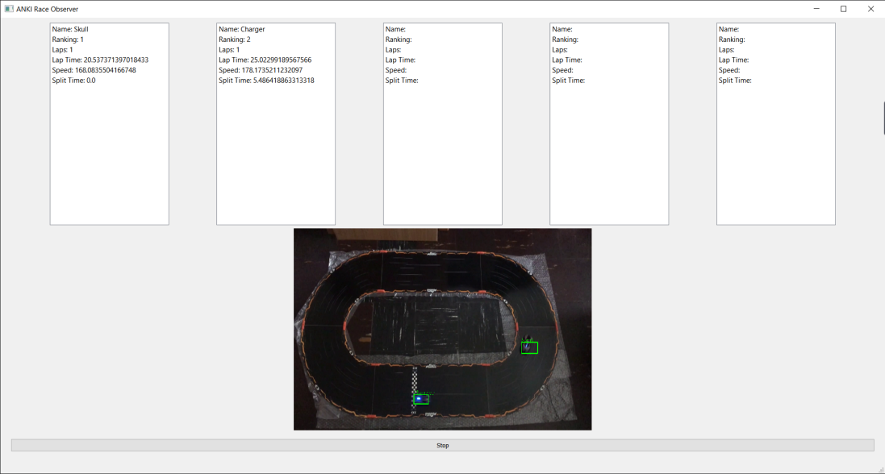
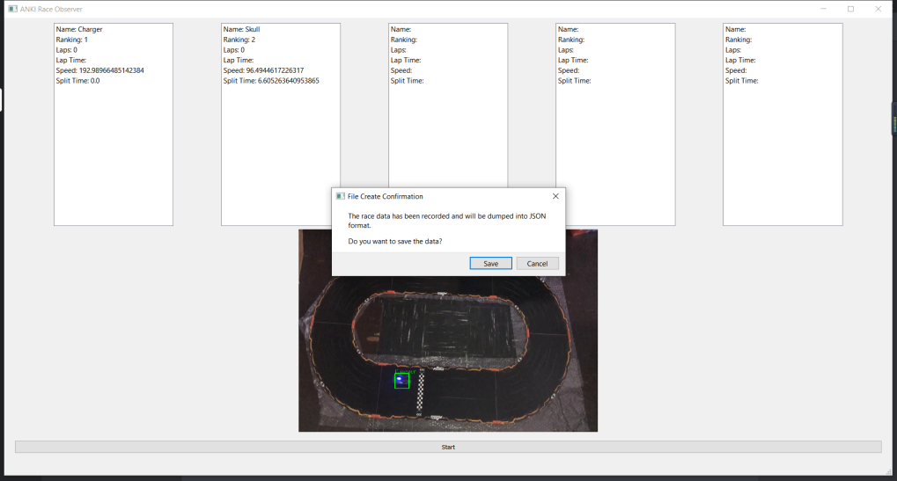

# Anki Race Observer

Anki Race Observer is tool to used to obtain stats from a Anki race using computer vision. Given a video stream of an Anki race the observer will detect each Anki car and will update their stats on screen as the video stream continues. Once the stream ends the user has the option can save the overall stats of the race in json format.

It is written in Python and uses Tensorflow for detection, OpenCV for image processing, and PyQt for its graphical user interface. 





### Installation

Anki Race Observer requires the following dependencies to run:

  - Tensorflow Object Detection API
  - OpenCV
  - PYQt5
  
To install the Tensorflow Object Detection API follow the [installation documentation.](https://github.com/tensorflow/models/blob/master/research/object_detection/g3doc/installation.md)

Install OpenCV using the following command:

```sh
$ pip install opencv-contrib-python
```

Install PYQt5 using the following command:

```sh
$ pip install PyQt5
```
